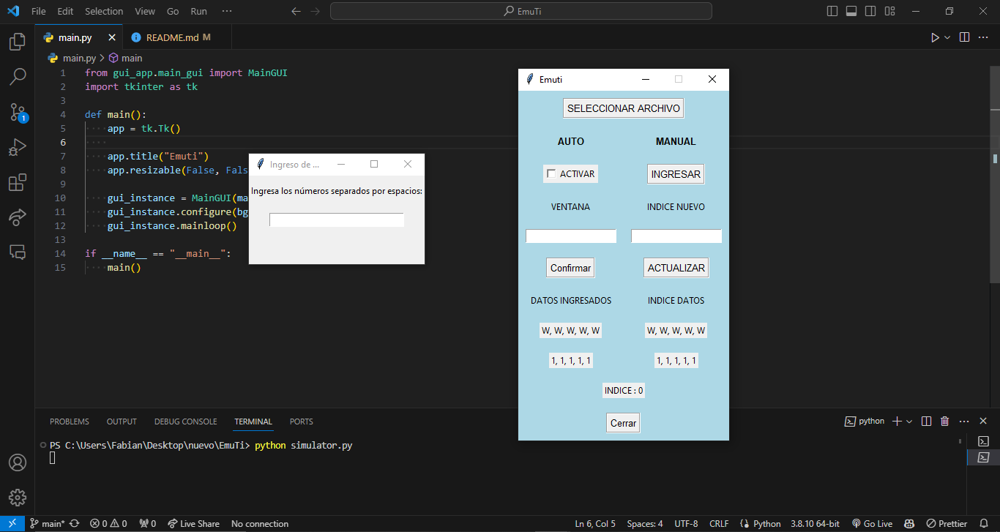

<div align="center">

# EmuTi

</div>

> Software para testear NRG de una maquina





https://github.com/Fabian-Martinez-Rincon/EmuTi/assets/55964635/b4e2345c-94df-42dc-aed9-5bc32e0e73bd


### Nuevo

```
pip install -r requirements.txt
```

#### Ejecturar en modo desarrollo

```
python main.py
```

#### Simulador de Ingreso de datos

```
python simulator.py
```

